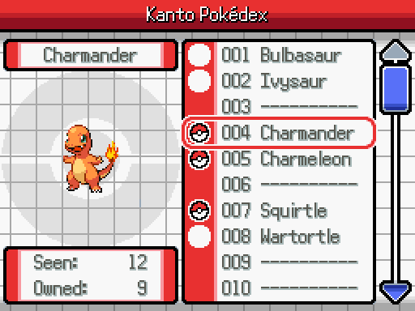
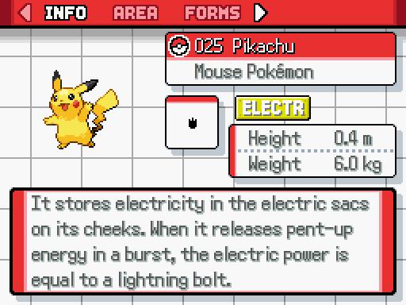
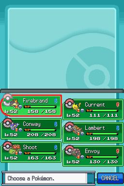

# Vue.js 3 Coding Challenge #1: Pokédex

_A Vue.js 3-driven Pokédex for the web!_

## Overview

Oak (your part-time project manager from the world of [Pokémon](https://en.wikipedia.org/wiki/Pok%C3%A9mon)) has tasked you with building a proof-of-concept user interface for an upcoming web application to help out with his research. The world of Pokémon is inhabited by creatures of the same name–which can be collected, trained, and battled with other Pokémon by individuals known as [Pokémon Trainers](https://bulbapedia.bulbagarden.net/wiki/Pok%C3%A9mon_Trainer).

Some individuals (like Oak, a [Pokémon Professor](https://bulbapedia.bulbagarden.net/wiki/Pok%C3%A9mon_Professor) when not managing software projects) would rather study Pokémon, which is how the [Pokédex](https://bulbapedia.bulbagarden.net/wiki/Pok%C3%A9dex) portable Pokémon database got its start. While on their adventure, trainers are able to catch new Pokémon in a device called a [Poké Ball](https://bulbapedia.bulbagarden.net/wiki/Pok%C3%A9_Ball). Upon first capture of a unique Pokémon, that Pokémon’s entry and associated data are added to the trainer’s Pokédex. The ultimate goal is to “catch ‘em all!”

However, the original goal of “catching them all” has been long-completed, and, with the prevalence of smartphones in the current year, no one wants to carry around an additional hand-held device used for the sole purpose of looking up Pokémon. Your task is to build a web-based example application to replicate some of the read-only functionality of the original hand-held devices for web (including mobile) using the latest complete version of the Pokémon database.

## Requirements

The data source should be <https://pokeapi.co/>, a free and open source read-only REST API that provides all of the data needed to complete this challenge. No authentication/authorization required!

### 1. Pokémon List

As a user, I want to be able to view a list of Pokémon. The list of Pokémon should at least contain:

- Pokédex Number (ID)
- Name
- Type(s)

Each item in the list should contain a set of action buttons, one to “view” (which allows the user to view a Pokémon’s details–this can be in the same view or another) and one to “add to team” (which allows the user to add a Pokémon to their team–a user shouldn’t be able to add more than six total–but duplicates are allowed–see “3. My Team” for more details).

#### Sort

Each column should be sortable (ascending or descending, either numerically or alphabetically depending on the column).

#### Pagination

As there are over 1,200 Pokémon, pagination should be implemented for the list view. The PokéAPI does [provide paginated responses by default, with parameters to tweak as needed.](https://pokeapi.co/docs/v2#resource-listspagination-section)

### 2. Pokémon Details

Upon clicking view, a details pane should appear next to or below the list (depending on screen size) with the following details:

- Name
- Pokédex Number
- Sprite (front view)
- Height (in feet and inches)
- Weight (in pounds)
- Flavor text (Pokédex description, in English)

### 3. My Team

As a user, I would like to add Pokémon to my team (up to six Pokémon). This should be persisted across browser refresh and/or new tabs using a Pinia store.

The My Team view should:

- Allow the user to remove a Pokémon from their team.
- Allow the user to view details of a Pokémon in their team (same requirements as Pokémon Details).

## Design

Due to their part-time job as a Gym Leader, the assigned designer for this application was not able to finish a proper Figma mock-up in time. _You’ll have to improvise!_

Project Manager Oak has requested we build the UI to be reminiscent of the Pokédex designs as represented in the Pokémon HeartGold/SoulSilver Version games for Nintendo DS. As the application is not built for a handheld, some artistic license can be taken with the design, as long as it's presentable.

Please note: the layout should be mobile-responsive. You can’t replace a portable device with a desktop-only application!

### List View



### Details View



### My Team View (Bottom Half)



## Bonus

These tasks are not required as part of your submission. You can complete as many or as few as you'd like!

### Pokémon Sprite in List View

Add a column on the left-hand side that displays the “mini” in-game sprite for each Pokémon in the table view (see the “My Team” design reference for an example).

### Search and Filters

A search bar should be implemented on the list view, which allows a user to search Pokémon by (at least) name and/or other attributes.

Filters should be also implemented on the list view (presumably alongside search), allowing a user to filter Pokémon by:

- Type
- Weight
- Height
- [Generation](https://bulbapedia.bulbagarden.net/wiki/Generation)

### Pokémon Team Reorder

A user should be able to re-order Pokémon in their team using a drag-and-drop interface. This order should be persisted across browser reloads.

## Tech Stack

Revolve Labs primarily uses Vue.js 3 for front-end web applications, and a boilerplate application has been provided along with this document. Inside, you’ll find the official Vue.js boilerplate “[Quick Start](https://vuejs.org/guide/quick-start)” application, along with:

- [Vue Router](https://router.vuejs.org/), Vue.js 3’s official router.
- [Pinia](https://pinia.vuejs.org/), a store library for Vue.js 3.
- [VueUse](https://vueuse.org/), a utility library for Vue.js 3.
- [Vitest](https://vitest.dev/) for unit tests.
- [Playwright](https://playwright.dev/) for e2e tests.
- [Element Plus](https://element-plus.org/en-US/), a UI component library for Vue.js 3.
  - This is pre-configured to allow you to focus on application logic–we use E+ here at RL. If you want to use a different component library (or roll-your-own), that’s fine too–just be aware this will extend the scope of the challenge.
- A custom font, “[Pokémon DP Pro](https://fontstruct.com/fontstructions/show/404271/pok_mon_dp_pro)”, which is reminiscent of the original font from Pokémon Diamond/Pearl/Platinum Versions for the Nintendo DS.

You are allowed to use as many libraries, custom components, and as much custom CSS as necessary–[Tailwind CSS](https://tailwindcss.com/) is also installed for your convenience. However, it’s understandable and acceptable if you want to use scoped styles, CSS-in-JS, or similar (which may be necessary due to limitations with Element Plus).

## Instructions

1. Fork this repository (your fork should be private).
2. Add <https://github.com/em1382> as a collaborator to your forked repository.
3. Create your solution based on the requirements. Be as creative as you’d like! You’ll be judged based on visual style in addition to code quality.
4. Write applicable e2e and unit tests (if you run out of time, just focus on testing core business logic–100% coverage isn’t make or break). If you’re more comfortable with using other frameworks (e.g. Cypress for e2e and Jest for unit testing) you’re welcome to swap out the installed frameworks.
5. Submit by requesting a review on your final PR from <https://github.com/em1382>.

This challenge has a time limit of three days (roughly 72 hours). As it’s understood that time zones vary by candidate, your submission will be due 72 hours from 7pm in your local time zone on the day after you receive this document.

## Recommended IDE Setup

[VSCode](https://code.visualstudio.com/) + [Volar](https://marketplace.visualstudio.com/items?itemName=Vue.volar) (and disable Vetur) + [TypeScript Vue Plugin (Volar)](https://marketplace.visualstudio.com/items?itemName=Vue.vscode-typescript-vue-plugin).

## Type Support for `.vue` Imports in TS

TypeScript cannot handle type information for `.vue` imports by default, so we replace the `tsc` CLI with `vue-tsc` for type checking. In editors, we need [TypeScript Vue Plugin (Volar)](https://marketplace.visualstudio.com/items?itemName=Vue.vscode-typescript-vue-plugin) to make the TypeScript language service aware of `.vue` types.

If the standalone TypeScript plugin doesn't feel fast enough to you, Volar has also implemented a [Take Over Mode](https://github.com/johnsoncodehk/volar/discussions/471#discussioncomment-1361669) that is more performant. You can enable it by the following steps:

1. Disable the built-in TypeScript Extension
    1) Run `Extensions: Show Built-in Extensions` from VSCode's command palette
    2) Find `TypeScript and JavaScript Language Features`, right click and select `Disable (Workspace)`
2. Reload the VSCode window by running `Developer: Reload Window` from the command palette.

## Customize configuration

See [Vite Configuration Reference](https://vitejs.dev/config/).

## Project Setup

```sh
npm install
```

### Compile and Hot-Reload for Development

```sh
npm run dev
```

### Type-Check, Compile and Minify for Production

```sh
npm run build
```

### Run Unit Tests with [Vitest](https://vitest.dev/)

```sh
npm run test:unit
```

### Run End-to-End Tests with [Playwright](https://playwright.dev)

```sh
# Install browsers for the first run
npx playwright install

# When testing on CI, must build the project first
npm run build

# Runs the end-to-end tests
npm run test:e2e
# Runs the tests only on Chromium
npm run test:e2e -- --project=chromium
# Runs the tests of a specific file
npm run test:e2e -- tests/example.spec.ts
# Runs the tests in debug mode
npm run test:e2e -- --debug
```

### Lint with [ESLint](https://eslint.org/)

```sh
npm run lint
```

---
For legal information, please see [DISCLAIMER.md](DISCLAIMER.md)
